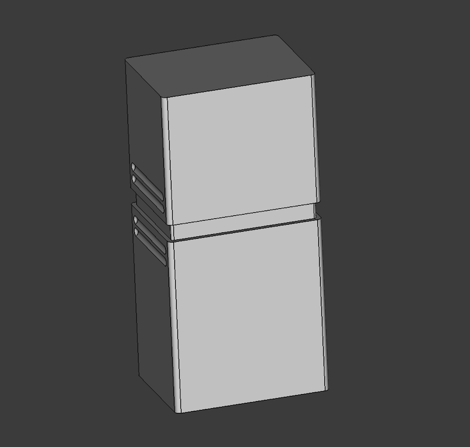

# flipper-zero-zimple-case

_A simple easy-to-print hard case that makes use of the foam packaging included with the Flipper Zero._

## Render

## Printed

## Description

This is a two-part case that utilizes passive retention to stay closed and requires no tools.  Simply print [sliding-cap.stl](sliding-cap.stl) and [sliding-bottom.stl](sliding-bottom.stl) with the open part faced upwards, transplant the foam packaging from the original Flipper Zero packaging, and you're done.